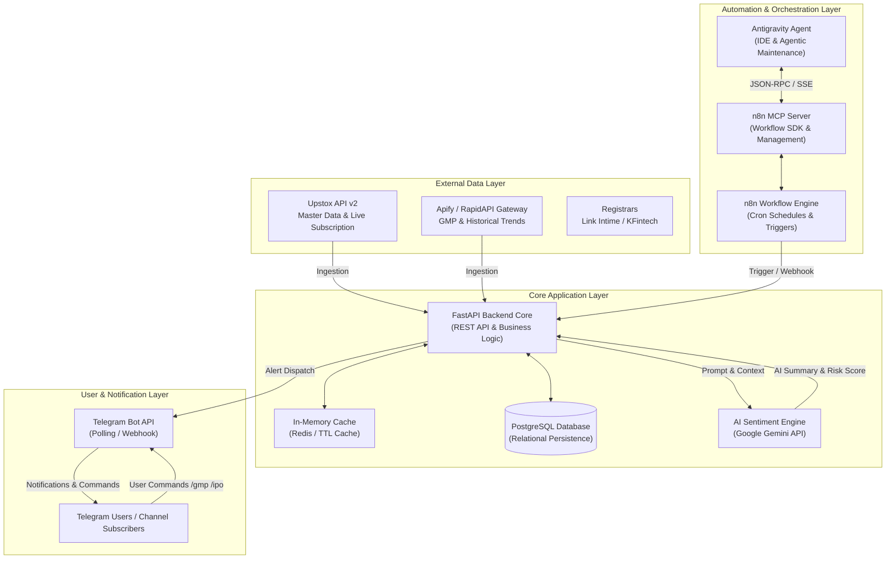
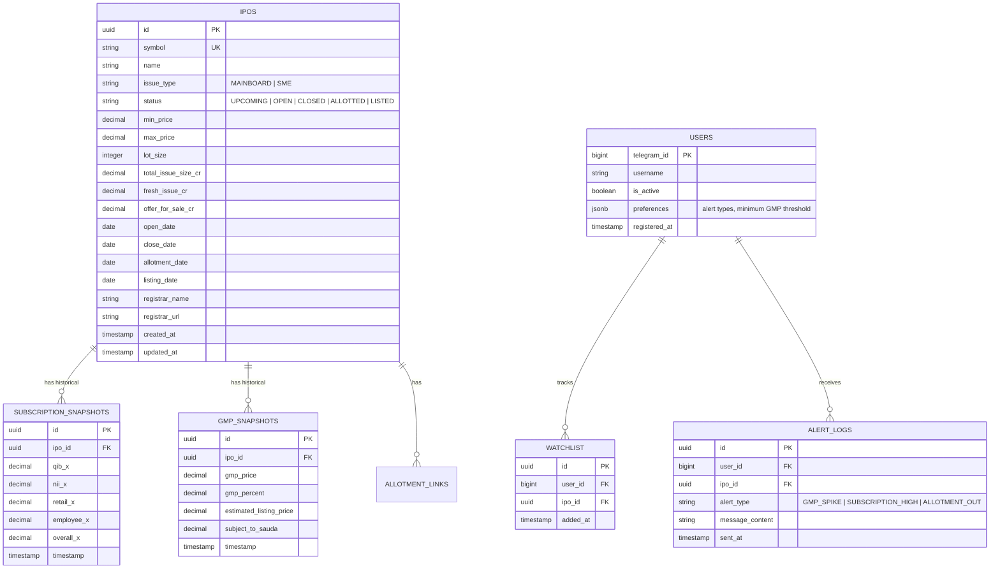

# System Architecture — Indian IPO Intelligence Telegram Platform

## Executive Summary
The **Indian IPO Intelligence Platform** is an enterprise-grade, event-driven system designed to track, analyze, and broadcast real-time Indian IPO insights, live subscription rates, Grey Market Premium (GMP) movements, allotment statuses, and AI-powered financial risk summaries to Telegram users.

The system combines **FastAPI** (core backend & API gateway), **PostgreSQL** (relational database), **n8n** (workflow automation engine), **Antigravity** (AI agent orchestration & tool manager via n8n MCP), **Telegram Bot API**, and **Gemini AI** (financial summary & sentiment engine).

---

## 1. High-Level Architecture Diagram

---

## 2. Component Specifications

### 2.1 Antigravity AI Agent
* **Role**: Lead engineering agent and autonomous workflow maintainer.
* **Responsibilities**:
  * Programmatically inspect, create, update, test, and manage n8n workflows via `n8n MCP Server`.
  * Validate workflow graph configurations using n8n Workflow SDK.
  * Generate backend schema migrations and business logic extensions.
* **Interface**: Model Context Protocol (MCP) SSE connection to `https://bharathkumar733.app.n8n.cloud/mcp-server/http`.

### 2.2 n8n Workflow Engine
* **Role**: Scheduled job runner, alert event dispatcher, and workflow orchestrator.
* **Key Workflows**:
  * `WF-01: Ingestion Sync Cron` (Runs every 15 mins during market hours 10 AM - 5 PM IST).
  * `WF-02: GMP Movement Alert Trigger` (Detects >10% GMP change and dispatches Telegram alerts).
  * `WF-03: Allotment Status Checker` (Polls on allotment dates for status updates).
  * `WF-04: Daily Evening Summary Digest` (Generates EOD recap report at 7:00 PM IST).
* **Interface**: Calls FastAPI endpoints (`POST /api/v1/ingest`, `POST /api/v1/alerts/dispatch`).

### 2.3 FastAPI Backend Core
* **Role**: Central application server, business logic layer, data normalization pipeline, and REST API gateway.
* **Modules**:
  * `Ingestion Engine`: Fetches raw data from Upstox API & GMP feeds, cleanses fields, calculates subscription ratios.
  * `Alert Engine`: Evaluates threshold triggers (e.g., subscription crossing 10x, GMP surging >15%).
  * `Bot Service`: Handles Telegram incoming webhook requests and generates interactive inline responses.
  * `AI Summarizer`: Formats RHP data and sends structured prompts to Gemini API for financial risk assessment.
* **Tech Stack**: Python 3.11+, FastAPI, Pydantic v2, SQLAlchemy 2.0 / AsyncPG, HTTPX.

### 2.4 PostgreSQL Database
* **Role**: Primary persistent ACID relational database.
* **Key Tables**:
  * `ipos`: Master IPO information (company, symbol, price band, lot size, issue size, dates, status).
  * `subscription_snapshots`: Historical hourly category-wise subscription data.
  * `gmp_snapshots`: Historical GMP, percentage returns, and Subject to Sauda rates.
  * `users`: Telegram subscriber profiles, notification preferences, watchlist.
  * `alert_logs`: Audit trail of broadcast notifications sent.

### 2.5 Telegram Interface
* **Role**: Delivery medium for alerts, daily digests, and interactive user queries.
* **Capabilities**:
  * Interactive bot commands (`/ipos`, `/gmp`, `/open`, `/upcoming`, `/allotment`, `/subscribe`).
  * Rich MarkdownV2 formatting with status badges (🟢 Open, 🟡 Upcoming, 🔴 Closed).
  * Inline keyboard buttons for direct registrar allotment links.

### 2.6 AI Layer (Google Gemini)
* **Role**: Summarizes complex Red Herring Prospectus (RHP) financial documents and generates investor-friendly key takeaways.
* **Features**:
  * Objective 3-bullet company overview.
  * Key financial metrics & valuation analysis (Revenue growth, PAT margin, P/E vs Peers).
  * Key Risk Factors identified in RHP.
  * Sentiment Score (-1.0 Bearish to +1.0 Bullish).

---

## 3. Database Schema (Entity Relationship Diagram)

---

## 4. End-to-End Data Flows

### Flow 1: Scheduled Ingestion & GMP Alert Trigger
1. **n8n Cron Trigger** fires every 15 minutes during market hours.
2. n8n sends HTTP request to FastAPI `/api/v1/ingest/sync`.
3. FastAPI queries **Upstox API v2** for live subscription & **Apify Gateway** for GMP.
4. FastAPI normalizes data and inserts new records into `subscription_snapshots` and `gmp_snapshots`.
5. If `latest_gmp` exceeds previous snapshot by >10%, FastAPI triggers an internal `GMP_SPIKE` event.
6. FastAPI formats a Markdown message with AI sentiment context and calls Telegram API to broadcast to subscribed users.

### Flow 2: User `/gmp` Telegram Command
1. User sends `/gmp` command in Telegram chat.
2. Telegram Webhook forwards request to FastAPI `/api/v1/telegram/webhook`.
3. FastAPI queries PostgreSQL for active IPOs with latest `gmp_snapshots`.
4. FastAPI formats an interactive response with inline buttons.
5. Response is delivered back to user in < 500ms.

---

## 5. Resilience, Circuit Breakers & Rate Limits

1. **Circuit Breaker Strategy**: If Upstox API returns 5xx error 3 consecutive times, FastAPI trips circuit breaker and switches to NSE/BSE fallback ingestion module for 30 minutes.
2. **API Rate Limit Protection**: Upstox API calls throttled at max 5 req/sec via Async Limiter.
3. **Database Connection Pooling**: SQLAlchemy AsyncEngine with `pool_size=20` and `max_overflow=10`.
4. **Idempotent Alerts**: Alert log table ensures duplicate notifications are never sent to Telegram users within a 2-hour window.
